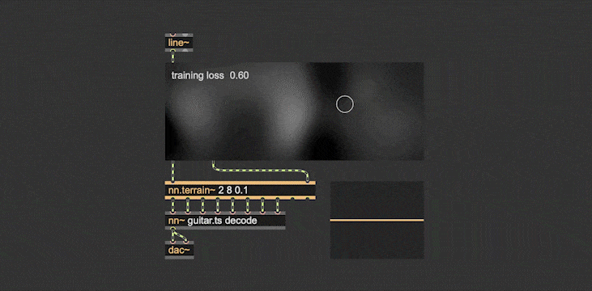
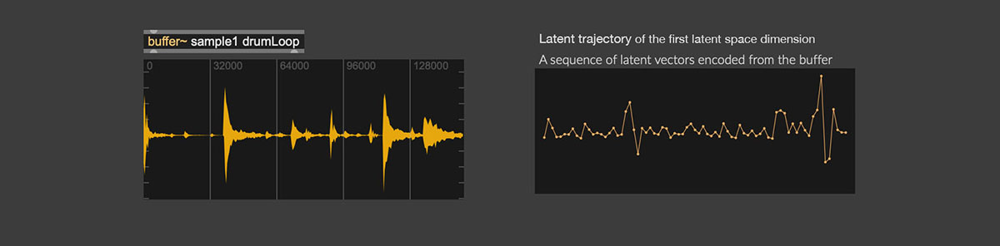
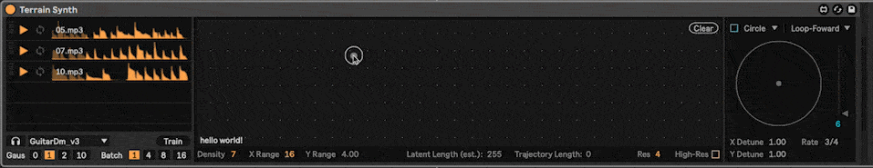
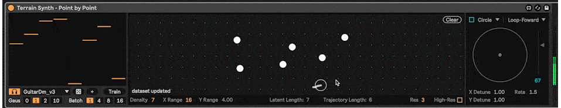
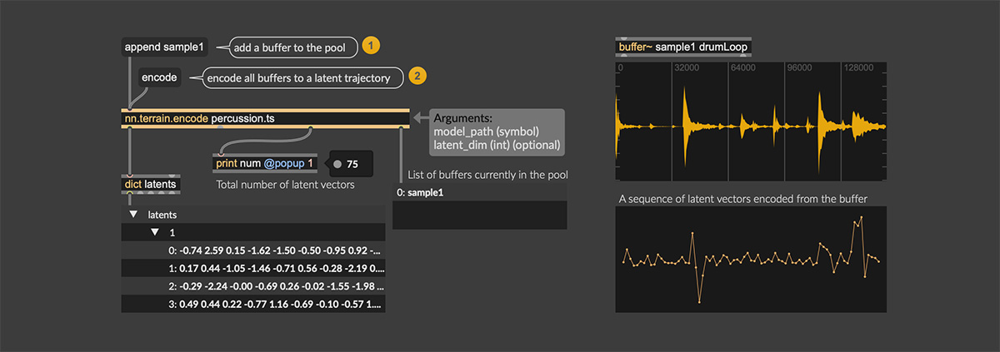
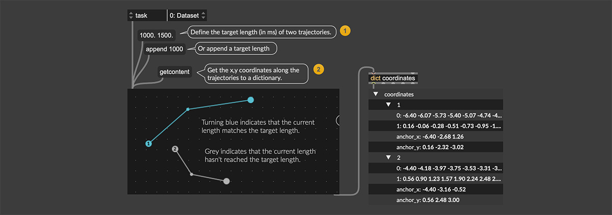
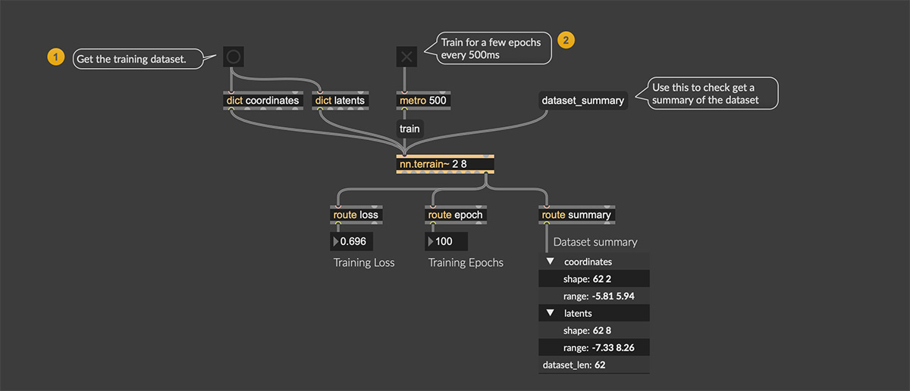
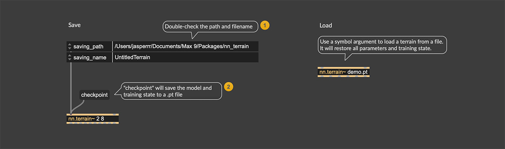
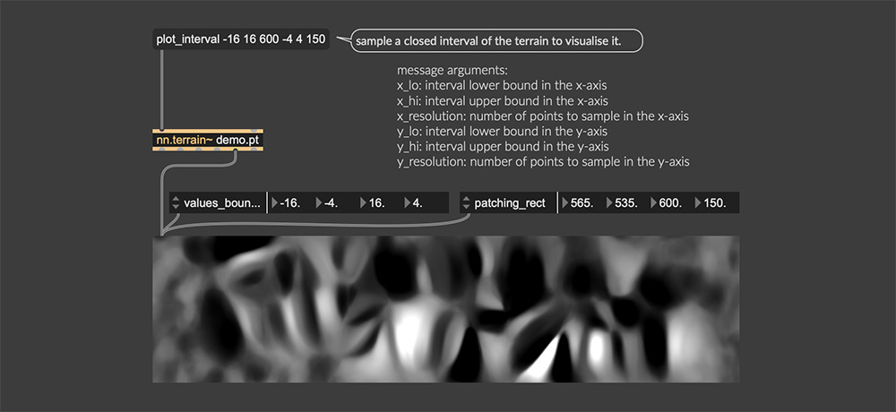
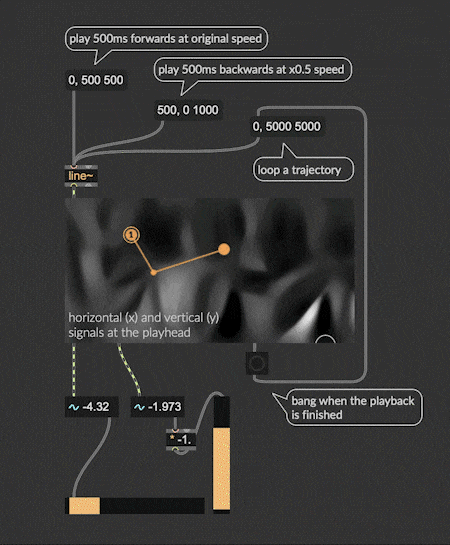

# Latent Terrain: Coordinates-to-Latents Generator for Neural Audio Autoencoders

> At the final stage of packaging up the repository, will get everything done by the end of May.  
Once ready, a release tag will be added to the repository, with the external objects, example Max patches, instructions to compile.

</img>

*Latent terrain* is a coordinates-to-latents mapping model for neural audio autoencoders, can be used to build a mountainous and steep surface map for the autoencoder's latent space. A terrain produces continuous latent vectors in real-time, taking coordinates in the control space as inputs.  

#### Table of Contents

- [What's a Neural Audio Autoencoder and why Latent Terrain?](#whats-a-neural-audio-autoencoder-and-why-latent-terrain)
- [Demos](#demos)
- [Compatibility & Installation](#compatibility-and-installation)
- [Usage](#usage)
  - [Building a customised terrain](#building-a-customised-terrain)
    <!-- - [Terrain parameters](#terrain-parameters)
    - [Training examples preparation](#training-examples-preparation)
    - [Training](#training)
    - [Saving (Checkpoints)](#saving-checkpoints) -->
  - [Visualising a terrain](#visualising-a-terrain)
  - [Programming trajectory playback](#programming-trajectory-playback)
  - [Stylus mode](#stylus-mode)
  - [Point-by-Point Steering](#point-by-point-steering)
- [TODOs](#todos)
- [Build Instructions](BuildInstructions.md)
- [Acknowledgements](#acknowledgements)

## Need help!

Hi, this is Shuoyang (Jasper). `nn.terrain` is part of my ongoing PhD work on **Discovering Musical Affordances in Neural Audio Synthesis**, and part of the work has been (will be) on putting AI audio generators into the hands of composers/musicians.

Therefore, I would love to have you involved in it - if you have any feedback, a features request, a demo / a device / or a ^@#*$- made with nn.terrain, I would love to hear. If you would like to collaborate on anything, please leave a message in this form: https://forms.office.com/e/EJ4WHfru1A

## What's a Neural Audio Autoencoder and why Latent Terrain? 

A neural audio autoencoder (such as [RAVE](https://github.com/acids-ircam/RAVE)) is an AI audio generation tool, it has two components: an encoder and a decoder.    
 - The `encoder` compresses a piece of audio signal into a sequence of latent vectors (a **latent trajectory**). This compression happens in the time domain, so that the sampling rate goes from 44100Hz (audio sampling rate) to 21.5Hz (latent space sampling rate).   
   

 - The `decoder` takes the latent trajectory to produce a piece of audio signal. The decoder can also be used as a parametric synthesiser by manually navigating the latent space (i.e., **latent space walk**).  

*Latent terrain* allows you to navigate latent space of the generative AI like walking on a terrain surface. It tailors the latent space to a low-dimensional (e.g., a 2D plane) control space. And this terrain surface is **nonlinear** (i.e., able to produce complex sequential patterns), **continuous** (i.e., allows for smooth interpolations), and **tailorable** (i.e., DIY your own materials with interactive machine learning).

This repository is a set of Max externals to build, visualise, and program latent terrain:

<table>
<thead>
<tr>
<th>Object</th>
<th>Description</th>
</tr>
</thead>
<tbody>

<tr><td><code>nn.terrain~</code></td>
<td> 

 - Load, build, train, and save a terrain.  

 - Perform the coordinates-to-latents mapping. 
 </td>
</tr>

<tr><td><code>nn.terrain.encode</code></td>
<td>

 - Encode audio buffers into latent trajectories using a pre-trained audio autoencoder, to be used as training data for `nn.terrain~`.
</td>
</tr>

<tr><td><code>nn.terrain.record</code></td>
<td>

 - Record latent trajectories to be used as training data for `nn.terrain~`.  
</td>
</tr>

<tr><td><code>nn.terrain.gui</code></td>
<td>

 - Edit spatial trajectories to be used as training data for `nn.terrain~`. 
 - Visualise the terrain.
 - Create and program trajectory playbacks.
</td>
</tr>

</tbody>
</table>

## Demos

The projection from a latent space to a latent terrain is done by pairing latent trajectories and spatial trajectories on a 2D plane (or any low-dimensional space). After providing examples of inputs (spatial trajectories) and their corresponding outputs (latent trajectories), the terrain can be trained very quickly (~15s) using supervised machine learning.

https://github.com/user-attachments/assets/17a306d2-791a-4322-9ec6-aa788713cbac

Sound synthesising with latent terrain is similar to wave terrain synthesis, operating in the latent space of an audio autoencoder. An audio fragment can be synthesised by pathing through the terrain surface.  

https://github.com/user-attachments/assets/2da6380f-272a-40ff-a595-07f7d4008e3b

<!-- Constructing a terrain by defining the trajectories of audio fragments:  
   

It also supports the point-by-point steering approach proposed by Vigliensoni and Fiebrink (2023):    
    -->

<!-- *Latent Terrain* is an algorithmic approach to dissecting the latent space of a neural audio autoencoder (e.g., [RAVE](https://github.com/acids-ircam/RAVE)) into a lower-dimensional (e.g., 2D), mountainous, and steep space. The dissected structure is a streamable "terrain", which can be used to access latent vectors given coordinates in the lower-dimensional space.

This is a (work-in-progress) Max external for sound synthesising with latent terrain, as well as creating letent terrains on-the-fly, using interactive machine learning.  

The external, demo Max patches, documentation and tutorials will be released soon. -->

A presentation at the IRCAM Forum Workshops 2025 can be found in [this article](https://forum.ircam.fr/article/detail/latent-terrain-dissecting-the-latent-space-of-neural-audio-autoencoder-by-shuoyang-jasper-zheng/).  

<!-- 
https://github.com/user-attachments/assets/39dc648f-7c11-4669-895a-1f46999ddca1 -->

## Compatibility and Installation

This external works with [nn_tilde v1.5.6 (torch v2.0.0/2.0.1)](https://github.com/acids-ircam/nn_tilde/releases/tag/v1.5.6). If you have a `nn~` built from another torch version, you might have to build this yourself. See the [Build Instructions](BuildInstructions.md) documentation.  

We only have MaxMSP version at the moment, sorry. Windows and arm64 macOS supported.

### macOS

Uncompress the `.tar.gz` file in the `Package` folder of your Max installation, which is usually in `~/Documents/Max 9/Packages/`.

Reopen Max and you can find all nn.terrain objects. You might get a quarantine warning, proceed will disable this warning. If they still have trouble opening, or doesn't work correctly with nn_tilde, you might want to build the externals yourself, see [Build Instructions](BuildInstructions.md).  

### Windows

Uncompress the `.tar.gz` file in the `Package` folder of your Max installation, which is usually in `~/Documents/Max 9/Packages/`.

Copy all `.dll` files in the package next to the ˋMax.exeˋ executable (if you have already done this for nn_tilde, you don't need to do this again).

## Usage
Here we briefly walk through the features/functionalities, while detailed walkthroughs can be found in the `.maxhelp` help file for each object.  

### Building a customised terrain

A terrain is built by pairing latent trajectories and coordinate trajectories. And then using a supervised machine learning algorithm to learn this pairing. Here are the steps:

#### Terrain parameters  

First, we'll define the dimensionality of the latent space and control space. This can be set by the first two arguments of the object. For instance, `nn.terrain~ 2 8` will create a terrain that takes 2 input signals and produces a 8-dimensional latent vector.  

Arguments of `nn.terrain~`:

<table>
<thead>
<tr>
<th>Object</th>
<th>Arguments</th>
<th>Description</th>
</tr>
</thead>
<tbody>

<tr><td rowspan=8>nn.terrain~</td>
<td>control_dim</td>
<td>Number of input channels</td>
</tr>

<tr><td>latent_dim</td>
<td>Number of output channels, this should usually be the dimensionality of the autoencoder's latent space.</td>
</tr>

<tr><td>gauss_scale</td>
<td> 
(optional)  

 - Gaussian scale of the Fourier feature mapping. A higher Gaussian scale leads to a noisy terrain, lower leads to smoother less-mountainous terrain. 
 - A float value between 0.05 - 0.3 is suggested.   
 - If the Gaussian scale is 0, the Fourier feature mapping layer will be removed, resulting in a very smooth (low-frequency) terrain, useful for point-by-point mode.</td>
</tr>

<tr><td>network_channel</td>
<td>(optional) The number of neurons in each hidden layer. Defined by the network_channel argument. By default 128</td>
</tr>

<tr><td>feature_size</td>
<td>(optional) The size of the random Fourier feature mapping, a higher feature size is suggested when using a high-dimensional control space. By default 256</td>
</tr>

<tr><td>buffer_size</td>
<td>(optional) The inference of the terrain will happen once per buffer size, keeping it the same with the buffer size of nn~ is suggested.</td>
</tr>

</tbody>
</table>

#### Training examples preparation   

 - Gethering **latent trajectories**:
   - Create a `nn.terrain.encode` and put audio sample(s) in `buffer~` or `polybuffer~`
   - Use `append` message to add buffers to the encoder, message `encode` to convert them to latent trajectory in a dictionary file.
   - Additionally, see `nn.terrain.encode`'s help file for how to encode samples from a `playlist~` object.

 - Gethering **spatial trajectories**:
   - Create a `nn.terrain.gui` and set the `UI Task (task)` attribute to `Dataset`
   - Define the target length of trajectories (in ms) using a list message or an `append` message. 
   - Draw lines as trajectories.  

#### Training  
 - Terrain training can be done within the `nn.terrain~` object:
   - Send the data dictionaries we got in previous step to `nn.terrain~`
   - The terrain will be trained for 10 epochs once a `train` message is received (this number can be changed by the `training_epoch` attribute).
   - `route` the last outlet to `loss` and `epoch` to inspect the training loss.
   
   - <table>
     <thead>
      <tr>
      <th>Object</th>
      <th>Training Attributes</th>
      <th>Description</th>
      </tr>
      </thead>
      <tbody>

      <tr><td rowspan=8>nn.terrain~</td>
      <td>training_batchsize</td>
      <td>Batch size used to train the neural network in the terrain (i.e., how many coordinate-latent pairs). Just a matter of memory consumption, won't affect the result too much.</td>
      </tr>

      <tr><td>training_epoch</td>
      <td>How many epochs will be trained once a <code>train</code> message is received.</td>
      </tr>

      <tr><td>training_lr</td>
      <td>Learning rate used when training.</td>
      </tr>

      <tr><td>training_worker</td>
      <td>The same effect as PyTorch dataloader's <code>num_workers</code>, won't affect the result too much.</td>
      </tr>

     </tbody>
     </table>
 - After you feel good about the training loss, the terrain is good to go.

#### Saving (Checkpoints)

 - Use the `checkpoint` message to save the tarrain to a `.pt` file. Saving name and path can be set in attributes.
 - Load a terrain `.pt` file by giving its file name as an argument.

### Visualising a terrain 

Since the control space is 2D, the latent space can be visualised by sampling the control space across a closed interval (i.e., width and height in this example). Use the `plot_interval` message to do this:  
 - `plot_interval` for 2D plane takes 6 arguments:
 - lower and upper bound values of the x and y axes in the control space (these usually are the same as the `values_bound` attribute of `nn.terrain.gui`)
 - resolution of the x and y axes (these usually are the same as the width and height of `nn.terrain.gui`)

### Programming trajectory playback  

You can create trajectories to navigate the terrain. This trajectory playback can be controled be a signal input. 
 - Set the 'UI Tasks' (`task`) attribute of nn.terrain.gui to 'play'.
 - This behaviour is similar to the `play~` object in Max.
 - </img>

### Stylus mode  

Set the 'UI Tasks' (`task`) attribute of nn.terrain.gui to 'stylus' to use it as a trackpad. If you are using a tablet/stylus, it also supports the pen pressure.

https://github.com/user-attachments/assets/2dd7edea-583d-410b-8b09-7aa1eec09bfa

### Point-by-Point Steering  

[todo] It also supports the [point-by-point steering approach](https://vigliensoni.com/portfolio/42-vigliensoni23steering/) proposed by Vigliensoni and Fiebrink (2023).

## TODOs   

- [✕︎] Load and inference scripted mapping model exported bt torchscript.   
- [✔︎] Display terrain visualisation.  
  - [✔︎] Greyscale (one-channel)   
  - [✔︎] Multi-channel (yes but no documentation atm)   
- [✔︎] Interactive training of terrain models in Max MSP.   
- [✔︎] Customised configuration of Fourier-CPPNs (Tancik et al., 2020).  
- [✕︎] Example patches, tutorials...  
- [✕︎] PureData

## Build Instructions  

If the externals have trouble opening in Max, or doesn't work correctly with nn_tilde, you might want to build the externals yourself, see the [Build Instructions](BuildInstructions.md) documentation.

## Acknowledgements

 - Shuoyang Zheng, the author of this work, is supported by UK Research and Innovation [EP/S022694/1].

 - This is built on top of acids-ircam's [nn_tilde](https://github.com/acids-ircam/nn_tilde), with a lot of reused code including the cmakelists templates, `backend.cpp`, `circular_buffer.h`, and the model performing loop in `nn.terrain_tilde.cpp`.  
 - Caillon, A., Esling, P., 2022. Streamable Neural Audio Synthesis With Non-Causal Convolutions. https://doi.org/10.48550/arXiv.2204.07064  
 - Tancik, M., Srinivasan, P.P., Mildenhall, B., Fridovich-Keil, S., Raghavan, N., Singhal, U., Ramamoorthi, R., Barron, J.T., Ng, R., 2020. Fourier Features Let Networks Learn High Frequency Functions in Low Dimensional Domains. NeurIPS.  
 - Vigliensoni, G., Fiebrink, R., 2023. Steering latent audio models through interactive machine learning, in: In Proceedings of the 14th International Conference on Computational Creativity.  

